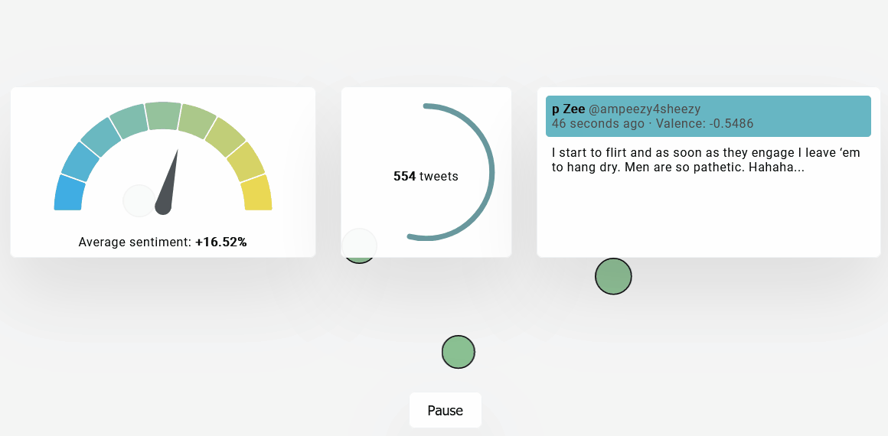

# bluebird

**bluebird** is a React application that conducts sentiment analysis and visualizes tweets being sent on Twitter in real-time.  It makes use of Web Workers to do all data processing and computation in a background thread client-side (sentiment analysis based on the [VADER](http://comp.social.gatech.edu/papers/icwsm14.vader.hutto.pdf) model) then generates a live visualization based on this data, along with additional metrics.

Live link to the application **[here](https://isaacong.me/bluebird/)**

## Demo

